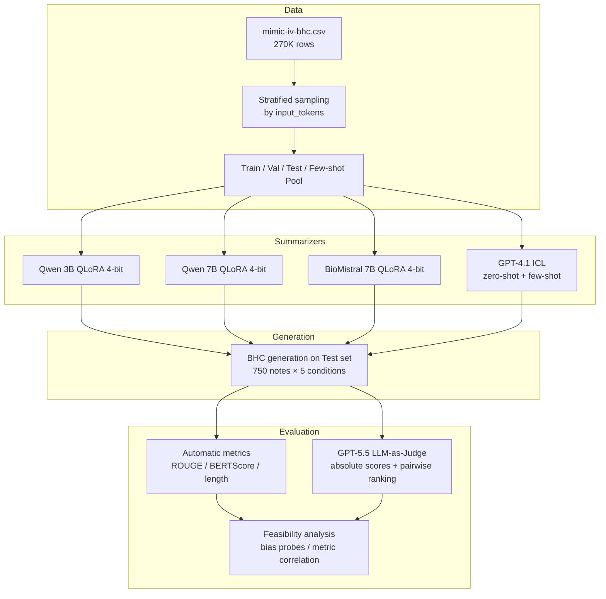

# ACCESS GPU Allocation Proposal

## Project Title

**Evaluating LLM Summarization and LLM-as-Judge Feasibility for Clinical Brief Hospital Course Generation**

---

## PI Information

| Field                      | Value                                                                                              |
| -------------------------- | -------------------------------------------------------------------------------------------------- |
| **Principal Investigator** | *Zhengxiong Li*                                                                                    |
| **Institution**            | *University of Colorado, Denver*                                                                   |
| **Email**                  | *[zhengxiong.li@ucdenver.edu](mailto:zhengxiong.li@ucdenver.edu)*                                  |
| **Field of Science**       | LLM/ Natural Language Processing / Health Informatics                                              |
| **Keywords**               | clinical NLP, summarization, LLM-as-judge, QLoRA, MIMIC-IV, discharge notes, brief hospital course |

---

## 1. Executive Summary

This project investigates whether large language models (LLMs) can (1) generate clinically useful Brief Hospital Course (BHC) summaries from discharge notes, and (2) serve as automated evaluators (“LLM as judge”) in clinical summarization settings **without human expert annotation**. Using the public **MIMIC-IV BHC dataset** (around 270,000 discharge note–BHC pairs), we will fine-tune three open-weight models via **4-bit QLoRA** (Qwen 3B, Qwen 7B, BioMistral 7B), benchmark **GPT-4.1** via in context learning (zero-shot and length matched few-shot), and use **GPT-5.5** as an automated judge to assess generation quality across multiple clinical dimensions.

The experiment uses **stratified subsampling by input token length** rather than the full dataset, enabling controlled comparison across note complexity while keeping GPU costs modest. ACCESS GPU resources are required exclusively for **model fine-tuning and batched inference** on open-weight models; API-based models (GPT-4.1, GPT-5.5) will be accessed separately via commercial endpoints.

**Requested resources:** ~**350 A100-equivalent GPU-hours**, ~**50 GB** project storage.

---

## 2. Scientific Background and Motivation

### 2.1 Clinical Problem

Discharge summaries are lengthy clinical documents. The **Brief Hospital Course (BHC)** section provides a concise narrative of a patient’s hospitalization—major events, treatments, and outcomes. Manually writing BHC text is time-consuming and contributes to clinician documentation burden. Automated BHC generation from discharge notes is a high-value clinical NLP task with direct relevance to hospital workflow efficiency.

### 2.2 Research Gap

Recent advances in LLMs have improved general-purpose summarization, but three open questions remain in **clinical settings**:

1. **Model comparison at practical scale:** Can parameter-efficient fine-tuning (QLoRA) on domain-specific models (BioMistral) outperform general models (Qwen) at comparable sizes? How do they compare to strong proprietary models (GPT-4.1) under fair, length-controlled prompting?
2. **Evaluation without experts:** Clinical summarization is traditionally evaluated by physician raters—a costly and non-scalable bottleneck. **LLM-as-judge** has shown promise in general NLP but lacks systematic validation in clinical documentation tasks, where factual accuracy and safety are paramount.
3. **Summarize - Judge pipeline:** Can the same LLM ecosystem support both generation and quality assessment, enabling iterative model development without human-in-the-loop evaluation?

### 2.3 Significance

This study is a **feasibility pilot**, not a clinical validation trial. Its significance lies in:

- Establishing a **reproducible benchmark pipeline** for BHC generation on MIMIC-IV
- Quantifying whether **GPT-5.5-as-judge** produces stable, bias-aware ratings that correlate with—but are not reducible to—automatic metrics (ROUGE, BERTScore)
- Informing future work on **scalable clinical NLP evaluation** where expert annotation is unavailable or prohibitively expensive
- Providing open methodology and stratified splits for the research community

**No human medical experts participate in this study.** All quality judgments are produced by GPT-5.5 under predefined rubrics.

---

## 3. Research Objectives

| #      | Objective                                                                                            | Success Criteria                                                           |
| ------ | ---------------------------------------------------------------------------------------------------- | -------------------------------------------------------------------------- |
| **O1** | Train QLoRA adapters (4-bit) for Qwen 3B, Qwen 7B, and BioMistral 7B on stratified MIMIC-IV BHC data | Three converged adapters with validation ROUGE-L tracked                   |
| **O2** | Benchmark GPT-4.1 (zero-shot and length-matched few-shot) on the same held-out test set              | Paired outputs for all test `note_id`s                                     |
| **O3** | Generate BHC predictions from all five model conditions on a fixed test split                        | Complete generation log (750+ samples × 5 conditions)                      |
| **O4** | Evaluate outputs with GPT-5.5 LLM-as-judge (multi-dimensional + pairwise ranking)                    | Judge scores with test-retest consistency ≥ 0.7                            |
| **O5** | Assess judge feasibility via bias probes and correlation with automatic metrics                      | Feasibility report on judge stability, length bias, and reference coupling |

---

## 4. Dataset and Experimental Design

### 4.1 Dataset

**Source:** `mimic-iv-bhc.csv` — a single CSV file derived from MIMIC-IV discharge notes.

| Column          | Description                                      |
| --------------- | ------------------------------------------------ |
| `note_id`       | Unique identifier (aligned with MIMIC-IV-Note)   |
| `input`         | Preprocessed discharge note text (excluding BHC) |
| `target`        | Cleaned, standardized BHC (ground truth)         |
| `input_tokens`  | Token count of input (GPT-4 tokenizer)           |
| `target_tokens` | Token count of target (GPT-4 tokenizer)          |

**Scale:** 270,033 records. Input tokens: median 2,166 (range 67–13,552). Target tokens: median 453 (range 1–6,341).

### 4.2 Stratified Sampling

Because input length strongly affects summarization difficulty and few-shot example selection, we stratify by `input_tokens` into five bins calibrated to the dataset distribution:

| Bin | `input_tokens` Range | Population Share |
| --- | -------------------- | ---------------- |
| S   | < 800                | 2.2%             |
| M1  | 800 – 1,500          | 17.4%            |
| M2  | 1,500 – 2,500        | 45.4%            |
| M3  | 2,500 – 4,000        | 31.1%            |
| L   | > 4,000              | 4.0%             |

**Sampled subset (fixed seed, no overlap across splits):**

| Split                        | Per Bin | Total     |
| ---------------------------- | ------- | --------- |
| Train (QLoRA)                | 400     | 2,000     |
| Validation                   | 75      | 375       |
| Test (final evaluation)      | 150     | 750       |
| Few-shot pool (GPT-4.1 only) | 25      | 125       |
| **Total sampled**            |         | **3,000** |

All four open-weight and API models share the **same test set** for fair comparison. The few-shot pool is drawn from training data and is disjoint from validation and test sets.

### 4.3 Summarization Models and Conditions

| ID  | Model         | Method                                                          | GPU Required |
| --- | ------------- | --------------------------------------------------------------- | ------------ |
| M1  | Qwen 3B       | QLoRA 4-bit fine-tuning                                         | Yes          |
| M2  | Qwen 7B       | QLoRA 4-bit fine-tuning                                         | Yes          |
| M3  | BioMistral 7B | QLoRA 4-bit fine-tuning                                         | Yes          |
| M4  | GPT-4.1       | Zero-shot in-context learning                                   | No (API)     |
| M5  | GPT-4.1       | Few-shot in-context learning (k=3–5, length-matched within bin) | No (API)     |

**Unified task prompt (all models):**

> Given the following discharge note, write a Brief Hospital Course (BHC) summarizing the patient's hospitalization, including major events, treatments, and outcomes. Do not include information not supported by the note.

**Few-shot length matching:** For each test instance, few-shot exemplars are selected from the same token length bin, ranked by closest `input_tokens` to the test case.

### 4.4 LLM-as-Judge

GPT-5.5 evaluates each generated BHC along six dimensions (1–5 scale + rationale):

1. **Clinical Accuracy** — factual alignment with the source note
2. **Completeness** — coverage of admission reason, treatments, complications, discharge status
3. **Conciseness** — absence of redundant repetition
4. **Coherence** — logical temporal flow
5. **Safety** — no dangerous omissions (medications, allergies, critical follow-up)
6. **Overall Quality** — holistic score

Two judge conditions are run to detect reference leakage:

- **Reference-blind:** note + generated BHC only (primary condition)  
- **Reference-aware:** note + generated BHC + ground-truth BHC (bias analysis)

Additionally, **pairwise ranking** across all five model outputs per `note_id` yields win-rate and Elo-style model rankings.

### 4.5 Automatic Metrics

Computed in parallel with judge evaluation for calibration:

- ROUGE-1/2/L, BERTScore  
- Length ratio (`gen_tokens / target_tokens`)  
- Optional entity overlap (medications, diagnoses)

---

## 5. Experimental Pipeline

---

## 6. Computational Methodology

### 6.1 Software Stack

| Component          | Tool                                                            |
| ------------------ | --------------------------------------------------------------- |
| Fine-tuning        | Hugging Face Transformers, PEFT, bitsandbytes (QLoRA 4-bit NF4) |
| Training framework | LLaMA-Factory or Axolotl                                        |
| Inference          | vLLM or Hugging Face `generate()` with batching                 |
| Metrics            | `evaluate`, `bert-score`                                        |
| Workflow           | Python 3.10+, PyTorch 2.x, CUDA 12.x                            |
| Containerization   | Apptainer/Singularity                                           |

### 6.2 QLoRA Configuration

| Parameter           | Value                                                             |
| ------------------- | ----------------------------------------------------------------- |
| Quantization        | 4-bit NF4                                                         |
| LoRA rank (r)       | 16–64 (tuned on validation)                                       |
| LoRA alpha          | 32                                                                |
| Target modules      | Query, key, value, output projections; MLP layers                 |
| Learning rate       | 1e-4 – 2e-4                                                       |
| Epochs              | 2–5 (early stopping on validation ROUGE-L)                        |
| Max sequence length | 4,096 tokens (covers ~95th percentile input)                      |
| Batch strategy      | Micro-batch 1–2 with gradient accumulation (effective batch 8–16) |

### 6.3 GPU Architecture Requirements

- **GPU type:** NVIDIA A100 (40 GB) or A100 (80 GB) preferred; A40 or H100 acceptable  
- **Single-GPU training:** QLoRA 4-bit enables single-GPU fine-tuning for all three models (3B and 7B)  
- **Memory:** ≥ 40 GB VRAM per training job (7B QLoRA at 4K context)  
- **No multi-node parallelism required** — jobs are embarrassingly parallel across models and hyperparameter trials  
- **Job duration:** 4–24 hours per training run (within standard queue limits)

---

## 7. Resource Request and Justification

### 7.1 GPU-Hour Breakdown

Estimates assume **NVIDIA A100 40GB** equivalent; actual ACCESS credits will be calculated per the target system's SU rate.

| Work Unit                        | Description                                                       | Runs | GPU-hrs/Run | Subtotal |
| -------------------------------- | ----------------------------------------------------------------- | ---- | ----------- | -------- |
| **Pilot**                        | End-to-end pipeline validation (Qwen 7B, 1 epoch, 100 test notes) | 1    | 8           | 8        |
| **Qwen 3B QLoRA training**       | Full train + 2 hyperparameter trials                              | 3    | 6           | 18       |
| **Qwen 7B QLoRA training**       | Full train + 2 hyperparameter trials                              | 3    | 18          | 54       |
| **BioMistral 7B QLoRA training** | Full train + 2 hyperparameter trials                              | 3    | 18          | 54       |
| **Ablation runs**                | LoRA rank / learning rate sensitivity (3 models × 1 run)          | 3    | 12          | 36       |
| **Validation inference**         | Periodic eval during training (all models, val set)               | 9    | 2           | 18       |
| **Test-set generation**          | Batched inference, 750 notes × 3 models                           | 3    | 4           | 12       |
| **Re-generation / recovery**     | Failed jobs, checkpoint restarts (20% buffer)                     | —    | —           | 36       |
| **Contingency**                  | Extended training, additional epochs if val loss not converged    | —    | —           | 44       |
|                                  |                                                                   |      | **Total**   | **~280** |

**Requested allocation: 350 A100 GPU-hours** (280 estimated + 25% contingency).

#### Justification Notes

- **Training dominates cost:** Each 7B QLoRA run at 2,000 samples × 3–5 epochs × 4,096 max length requires 15–20 GPU-hours on a single A100. Three models with hyperparameter search (3 runs each) yields about 126 GPU-hours.
- **Subsampling keeps costs feasible:** Using 2,000 training samples (0.75% of the full corpus) rather than 270K reduces training time by 60× while preserving length-stratified representation.
- **QLoRA 4-bit is essential:** Full fine-tuning of 7B models would require multi-GPU setups and 3–5× more GPU-hours; QLoRA makes single-GPU training possible on ACCESS standard nodes.
- **Inference is lightweight:** 750 test notes at batch size 8–16 completes in 3 GPU-hours per model.

### 7.2 Storage

| Item                                     | Size                                                                           |
| ---------------------------------------- | ------------------------------------------------------------------------------ |
| Raw dataset (`mimic-iv-bhc.csv`)         | ~1.5 GB                                                                        |
| Processed splits and metadata            | ~50 MB                                                                         |
| Model checkpoints (3 adapters × ~200 MB) | ~600 MB                                                                        |
| Generation outputs (750 × 5 conditions)  | ~100 MB                                                                        |
| Logs, metrics, judge outputs             | ~200 MB                                                                        |
| **Total**                                | **~3 GB** (request **50 GB** for checkpoint versioning and ablation artifacts) |

---

## 8. Efficient Resource Use

- **Early stopping** prevents over-training beyond validation convergence  
- **Mixed-precision (bf16/fp16)** computation during training  
- **Gradient checkpointing** if memory constraints arise at 4K context  
- **Parallel model training:** three models can train concurrently on separate GPU nodes  
- **No full dataset preprocessing on GPU** — tokenization cached on CPU/storage before training

---

## 9. Expected Outcomes and Deliverables

| Deliverable                  | Description                                                                                        |
| ---------------------------- | -------------------------------------------------------------------------------------------------- |
| **Stratified data splits**   | Published `note_id` lists for train/val/test/few-shot (shareable with credentialed MIMIC-IV users) |
| **QLoRA adapter weights**    | Three fine-tuned adapters with model cards                                                         |
| **Generation benchmark**     | 750 × 5 condition outputs with metadata                                                            |
| **Judge rubric and prompts** | Documented GPT-5.5 evaluation protocol                                                             |
| **Feasibility report**       | Judge stability, bias analysis, correlation with automatic metrics                                 |
| **Manuscript**               | Target venue: clinical NLP or health informatics conference (e.g., ML4H, AMIA Informatics Summit)  |

---

## 10. Broader Impact

- **Reducing documentation burden:** If feasible, automated BHC generation could assist clinical workflows (future work requires prospective validation).  
- **Scalable evaluation methodology:** A validated LLM-as-judge protocol could accelerate clinical NLP research where expert annotation is unavailable.  
- **Open science:** Stratified splits and evaluation pipeline enable reproducible benchmarking on MIMIC-IV.  
- **Responsible AI:** The study explicitly tests for judge biases (length, position, reference coupling), contributing to safer deployment considerations.

**Limitations acknowledged:** This is a feasibility study without physician validation. Results will not be interpreted as clinical recommendations.

---

